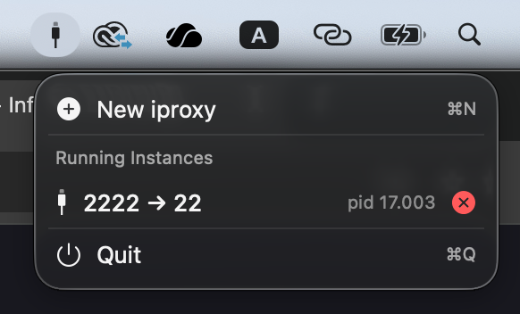

# Mooring

A macOS menu bar util for managing [iproxy](https://libimobiledevice.org/) instances.

## Features

- Create new iproxy port forwarding instances
- View all running iproxy processes
- Stop instances with one click

## Requirements

- macOS (SwiftUI, requires macOS 14+)
- `iproxy` installed via Homebrew (`brew install libimobiledevice`)
- I might bundle iproxy in the future
